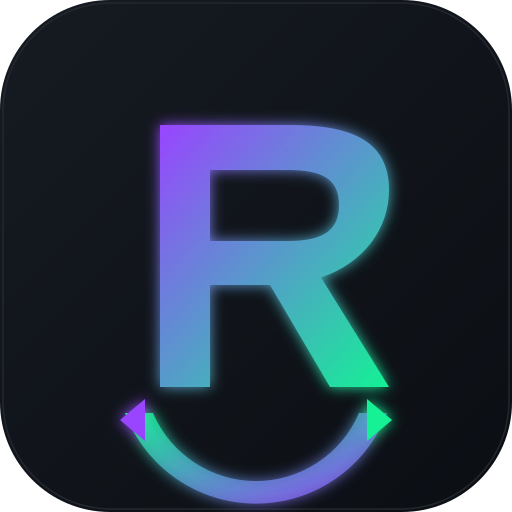

<p align="center">
  
</p>

<h1 align="center">Relay</h1>

<p align="center">
  Clone any on-chain Solana program into a local LiteSVM sandbox.<br/>
  Patch PDA state. Simulate, replay, trace, and diff transactions — without touching mainnet.
</p>

<p align="center">
  <a href="#install"></a>
  <a href="LICENSE"></a>
  <a href="#contributing"></a>
</p>

---

## What is Relay?

Relay is an Electron desktop app + Node CLI that runs a **per-project, per-session LiteSVM sandbox** loaded with real on-chain Solana programs.

- **Clone any program** by pubkey — Relay fetches the ELF, account state, and any Anchor IDL.
- **Patch state** of cloned PDAs and native accounts (SPL Token mint authority, Token-2022 fields, raw splices). Make USDC mintable to your own keypair. Set a DEX pool to a specific tick. Anything.
- **Replay mainnet transactions** locally — Relay hydrates every touched account at `slot - 1`, runs the same tx in LiteSVM, and diffs the result.
- **Build, simulate, and send transactions** through a Tx Builder UI with Anchor IDL-aware fields, account suggestion, and instruction-level edit-in-place.
- **Workflows** chain multiple steps (airdrop, warp time, warp slot, expire blockhash, reset session, send tx) into reusable scripts.
- **JSON-RPC server** — publish a session as a Solana-compatible RPC endpoint. Point any client (`@solana/web3.js`, Anchor, Phantom dev mode, your own dApp) at `http://localhost:8899/session/<id>` and it'll talk to your LiteSVM as if it were mainnet.

## Install

```bash
pnpm install
pnpm build
```

Requires Node ≥ 20 (see `.nvmrc`), pnpm 11.

## Desktop app

```bash
pnpm --filter @relay/desktop dev      # Electron + Vite HMR
pnpm --filter @relay/desktop build    # production bundle
pnpm --filter @relay/desktop package  # builds DMG / NSIS / AppImage in release/
```

The Tx Builder, Workflow runner, Keypair vault, Patch editor, and Inspector all live here. Native modules (`litesvm`, `better-sqlite3`) load under Electron's Node ABI.

## CLI

```bash
# Create a project
pnpm cli project create "DEX Integration" --rpc https://api.mainnet-beta.solana.com

# Clone a program into it
pnpm cli program add MemoSq4gqABAXKb96qnH8TysNcWxMyWCqXgDLGmfcHr --project <pid>

# Clone an account / PDA
pnpm cli account add <pubkey> --project <pid> --program <programId> --label "pool A"

# Open a session and send a tx
pnpm cli session create main --project <pid>
pnpm cli tx send --session <sid> --program <programId> \
  --data 68656c6c6f --account "<pubkey>:false:true"

# Replay a real mainnet tx in LiteSVM (needs archive RPC for slot-1 reads)
pnpm cli tx replay <signature> --session <sid> --rpc-url <archive-rpc-url>
```

## Publish a session as a JSON-RPC endpoint

Inspector → **Details** → **RPC endpoint** → **Start**. Copy the session URL:

```
http://127.0.0.1:8899/session/<session-id>
```

Point anything Solana-compatible at it. See `examples/mint-usdc/` for a runnable example that mints mainnet USDC into a fresh wallet against a Relay session.

## Architecture

```
Renderer (sandbox)
   │ ipcRenderer
   ▼
Electron main process
   │ Worker MessagePort
   ▼
Core worker (Node) — LiteSVM via NAPI
   │
   ├── Tx Builder + Workflow Runner
   ├── Patch engine (Anchor IDL + native layouts)
   ├── Snapshot engine (deterministic state hash)
   ├── Replayer (slot-1 hydrate + execute + diff)
   └── Solana JSON-RPC server (HTTP / per-session)
```

## Layout

```
packages/shared       types, zod schemas, IPC method names, errors
packages/core         headless engine
  svm/                LiteSVM wrapper
  cloner/             RPC clone (ELF + accounts + cache)
  patcher/            Anchor IDL coder + IDL store + setField
  trace/              log → instruction tree parser
  replayer/           historical tx hydrate + execute + diff
  runtime/            per-session LiteSVM lifecycle + tx builder + workflow
  snapshot/           deterministic state snapshots + fork + diff
  keypair/            sandbox keypair vault (safeStorage hook)
  scripting/          vm.Context sandbox with network allowlist
  rpc-server/         Solana JSON-RPC HTTP server
  store/              Project / Session catalogs + JSON persistence
  rpc/                IPC dispatcher + handler map + Worker bridge
packages/core-cli     CLI driver
packages/desktop      Electron + React shell
examples/             runnable examples that talk to a session via JSON-RPC
```

## Tests

```bash
pnpm test
```

## Contributing

Pull requests, issues, and discussion welcome. Read **[CONTRIBUTING.md](CONTRIBUTING.md)** before opening a PR.

## License

[PolyForm Noncommercial 1.0.0](LICENSE).
You can use, modify, and redistribute Relay **for any noncommercial purpose** — research, personal projects, education, internal tooling at a noncommercial organization, etc.
You cannot use Relay for commercial purposes without a separate commercial license. Contact the maintainer.
